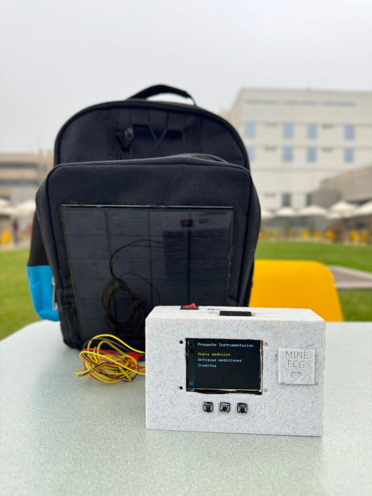

# Backpack EKG

**An energy-autonomous, standalone three-lead EKG platform for off-grid screening applications.**

[](https://github.com/FabianNanaAlfaro/backpack-ekg/actions/workflows/ci.yml)
[](https://doi.org/10.1109/MeMeA69746.2026.11537340)
[](LICENSE)



This repository is the public engineering companion to the paper **“Backpack EKG: An Energy-Autonomous Standalone Three-Lead EKG Platform for Off-Grid Screening Applications”**, presented at IEEE MeMeA 2026 and associated with DOI [10.1109/MeMeA69746.2026.11537340](https://doi.org/10.1109/MeMeA69746.2026.11537340).

It contains the reusable parts of the project: corrected ESP32 firmware, a portable two-threshold heart-rate estimator, a three-lead plotting sketch, synthetic tests, hardware notes and a small interactive project site. It intentionally does **not** contain private recordings, databases, calibration files, patient information, video software, or diagnostic software.

## What is here

| Area | Public artifact |
| --- | --- |
| Acquisition | Two AD8232 channels through the Xspace Bio v1.0 board |
| Three-lead display | Lead I and Lead II measured; Lead III derived as `Lead II - Lead I` |
| Heart-rate estimation | Hysteresis threshold crossing, temporal validation and seven-value smoothing |
| Embedded UI | ESP32 + 2.2” TFT + three buttons |
| Offline logging | Optional SD-card CSV stream; generated recordings are ignored by Git |
| Verification | Simulator-oriented reference table transcribed from the associated paper |
| Public presentation | Interactive static site in [`site/`](site/) |

## Start with the code

The main sketch is [`firmware/backpack_ekg/backpack_ekg.ino`](firmware/backpack_ekg/backpack_ekg.ino). It is organized around a non-blocking UI and a 1 kHz acquisition task, while SD logging is throttled to approximately 120–125 samples/s so the display and storage layers do not control the acquisition timing.

The heart-rate estimator is deliberately standalone and has no Arduino dependency:

```cpp
#include "BpmEstimator.h"

BpmEstimator bpm(2.18f, 2.14f);  // upper threshold must be above lower

if (bpm.update(filteredLeadI, sampleTimeMs)) {
  Serial.println(bpm.bpm());
}
```

The same logic is implemented in Python in [`analysis/bpm_estimator.py`](analysis/bpm_estimator.py) and exercised by the tests in [`tests/`](tests/).

## Why the BPM code looks this way

The historical firmware did not depend on a geometrically perfect R-peak location. It treated a rising crossing of an upper threshold as a beat event, then waited for the signal to cross a lower threshold before arming again. The interval between valid crossings gives:

```text
BPM = 60,000 / interval_ms
```

The corrected implementation keeps that project-specific behavior and adds the safeguards that were missing from the public legacy sketch:

1. `upper > lower` is enforced so hysteresis has the intended direction.
2. Beat timestamps come from the acquisition clock rather than a display delay.
3. Intervals outside the configured 30–330 BPM range are rejected.
4. The output is the mean of the last seven valid interval estimates.
5. A high signal cannot create duplicate beats until it has returned below the lower threshold.

This is a heart-rate estimator for an engineering prototype and screening workflow. It is not a diagnostic algorithm and must be calibrated for the exact analog gain, electrode arrangement and firmware sampling path.

## Hardware quick start

The firmware targets an ESP32-WROOM-32 with the Xspace Bio v1.0 board, two AD8232 front ends, an Adafruit ILI9341 TFT and an SD card. Install the board-specific XSpace library plus:

- `Adafruit GFX Library`
- `Adafruit ILI9341`
- `SD` and `SPI` from the ESP32 Arduino core

The historical pin contract is documented in [`docs/hardware.md`](docs/hardware.md). It is kept visible because the XSpace library is board-specific and cannot be reconstructed safely from this repository alone.

## Reproducible engineering checks

From the repository root:

```text
python -m unittest discover -s tests -p "test_*.py"
```

On a Unix-like system with a C++ compiler:

```text
g++ -std=c++17 -Wall -Wextra -pedantic tests/test_bpm_cpp.cpp -o /tmp/test_bpm_cpp
/tmp/test_bpm_cpp
```

The public-release audit is [`scripts/public_audit.ps1`](scripts/public_audit.ps1). It fails if private-data extensions or common credential patterns are introduced accidentally.

## Verification reference

The associated paper reports simulator-based heart-rate verification at 30, 60, 100, 150, 180, 210 and 320 BPM, with a reported mean absolute error of 0.19 BPM and mean relative error of 0.09% under steady-state laboratory conditions. Those values are publication-level results; they are not claimed as a fresh run of this repository. See [`docs/validation.md`](docs/validation.md).

## Attribution

### Paper authors

The associated publication credits the following authors:

1. **Fabian A. Nana**
2. **Andrea Razuri-Madrid**
3. **Alvaro Cigaran**
4. **Nadira Oviedo**
5. **Bruno Tello**
6. **Adrian Gutierrez**
7. **Leslie Y. Cieza**

Affiliations reported in the paper are the Biomedical Engineering Program at Universidad Peruana Cayetano Heredia and the Faculty of Science and Engineering at Pontificia Universidad Católica del Perú, Lima, Peru.

The paper acknowledges **XStudio Lab / XSpace** for access to the **Xspace Bio v1.0** board. See [`docs/credits.md`](docs/credits.md) for the complete attribution note and [`docs/media.md`](docs/media.md) for image provenance.

This repository is an engineering curation and correction of project code. The list above is publication credit, not an invented line-by-line contribution statement.

## Public-release boundary

Included: firmware structure, algorithm implementation, pin contract, synthetic tests, public project photographs and a publication-linked architecture overview.

Excluded: human recordings, raw simulator exports, SD-card data, personal identifiers, calibration assets, unpublished results, medical records, video software and credentials.

## Historical sources

The recovery started from the public legacy files in [`FabianNana0502/codigos`](https://github.com/FabianNana0502/codigos). The original files are preserved under [`legacy/`](legacy/) for traceability only; they are not the recommended firmware to flash.
