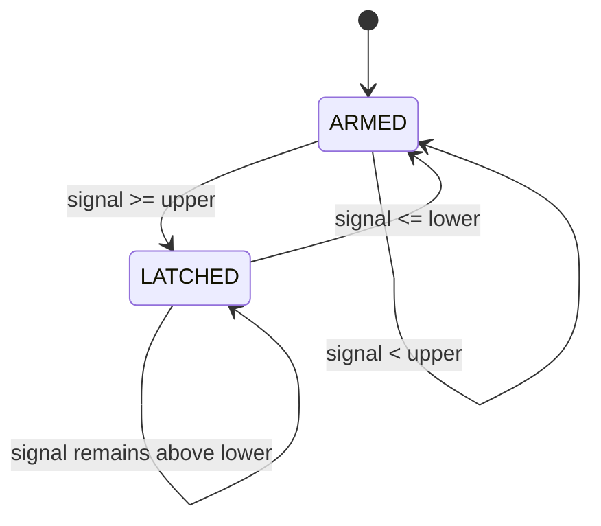

# BPM estimator: threshold crossing with hysteresis

The project’s historical BPM routine was based on a practical thresholding trick rather than a precise geometric search for the maximum of every QRS complex. The signal crosses an upper line once per beat, the crossing time is stored, and the detector is re-armed only after the signal falls below a lower line.



## Estimator contract

The implementation is [`firmware/backpack_ekg/BpmEstimator.h`](../firmware/backpack_ekg/BpmEstimator.h). It accepts one filtered sample and its acquisition timestamp:

```cpp
const bool updated = estimator.update(sample, timestamp_ms);
```

An update is emitted only when a valid interval is accepted. The estimate is:

```text
interval_ms = beat_time[n] - beat_time[n - 1]
BPM         = 60,000 / interval_ms
```

Intervals are accepted only inside the configured 30–330 BPM range. The displayed value is the arithmetic mean of the last seven accepted BPM values, matching the smoothing strategy described for the project firmware.

## Why the two thresholds matter

Using one threshold alone allows a broad QRS complex, noise or ringing to generate multiple beat events. The lower threshold creates a reset condition. The gap between the thresholds is the hysteresis band:

```text
lower threshold < upper threshold
```

The legacy sketch in the old repository contains one version with `UpperThreshold = 2.45` and `LowerThreshold = 2.60`. That ordering is inverted for hysteresis. The corrected sketch keeps the functional project values `2.18` and `2.14` as explicit defaults, but the right values must be tuned to the analog output of the exact board and electrode setup.

## Sampling and timing

The ESP32 acquisition task timestamps the filtered sample near the 1 ms update loop. The TFT is updated less frequently and SD logging is throttled independently. Therefore neither display refresh nor SD write latency determines the BPM interval.

This separation is important: a visually smooth plot is not proof of a stable sampling clock, and a stable BPM value is not proof of diagnostic-grade waveform fidelity.

## Calibration checklist

1. Feed a stable simulator rhythm or a safe bench signal into the acquisition chain.
2. Inspect the filtered signal range over several cycles.
3. Set `upper` above the baseline/noise band and below the intended QRS excursion.
4. Set `lower` below `upper`, close enough to re-arm after the complex but far enough to reject ringing.
5. Confirm no duplicate event occurs while the signal remains above `lower`.
6. Verify the 30–330 BPM guard at the low and high operating points.

The repository tests use synthetic pulses only. They do not replace electrical safety checks, calibration, or clinical validation.

