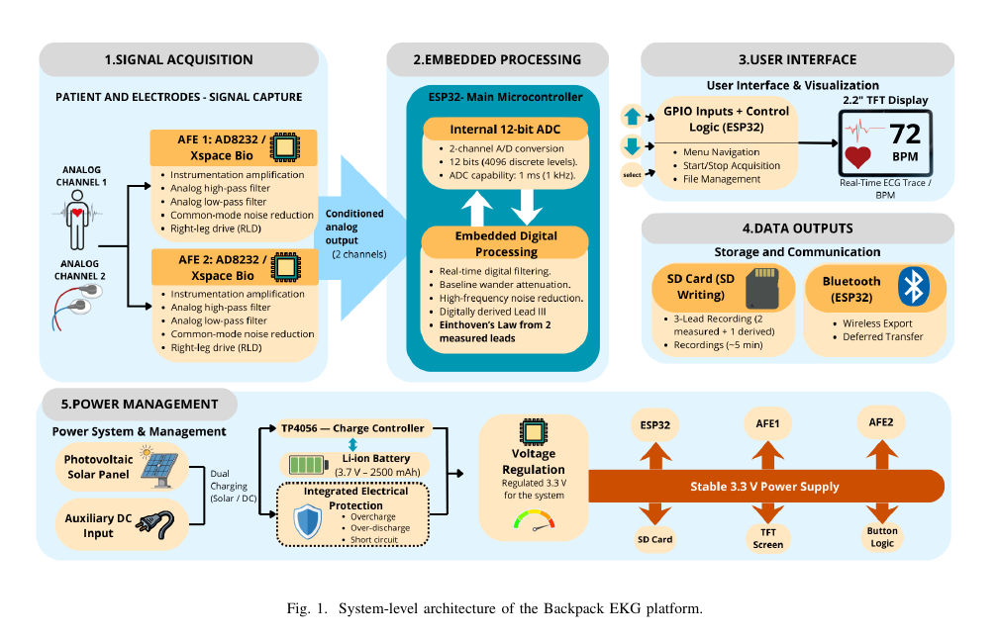

# Hardware and signal path

## Signal architecture

The public firmware follows the project architecture described in the associated paper:

1. AD8232 front end in Xspace Bio slot 1 acquires one measured lead.
2. AD8232 front end in Xspace Bio slot 2 acquires the second measured lead.
3. Each measured channel is filtered with the XSpace second-order low-pass helper at a nominal 40 Hz cutoff and 1 ms update period.
4. The third displayed lead is derived digitally using the Einthoven relation:

   ```text
   Lead III = Lead II - Lead I
   ```

5. The ESP32 renders all three traces and optionally streams samples to the SD card.



## Pin contract inherited from the public prototype

| Function | GPIO |
| --- | ---: |
| ILI9341 `CS` | 17 |
| ILI9341 `RST` | 21 |
| ILI9341 `DC` | 22 |
| SD `CS` | 16 |
| SD `MOSI` | 23 |
| SD `MISO` | 19 |
| SD `SCK` | 18 |
| Button up | 0 |
| Button down | 2 |
| Button select | 32 |
| Battery level input (reserved) | 36 |

The AD8232 channels are accessed through the board library symbols `AD8232_XS1` and `AD8232_XS2`. The repository does not redistribute that board-specific library; install the version supplied by the XSpace Bio v1.0 development environment.

## Power and storage boundary

The associated paper describes a rechargeable Li-ion supply, photovoltaic-assisted charging, voltage regulation and local SD logging. This repository contains the firmware interface and pin contract, not a battery-management design or a safety-certified power subsystem.

Generated recordings use the temporary path `/PENDING.CSV` and are renamed only after the user selects “save”. The `.gitignore` blocks CSV and common biomedical artifact formats so an accidental local recording cannot become a Git commit.

## Safety

This is a laboratory/prototype platform. Do not connect an uncertified device to a person, mains-referenced equipment or a clinical workflow without appropriate isolation, risk assessment, electrical safety review and institutional approval.

